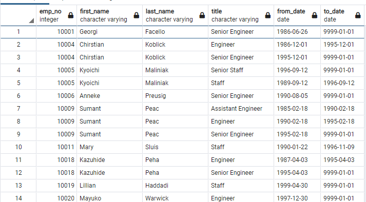
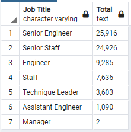
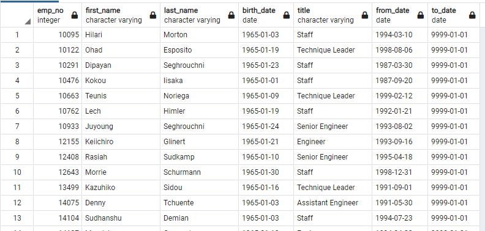
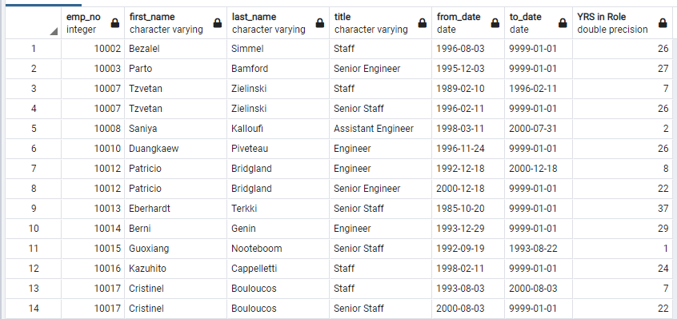
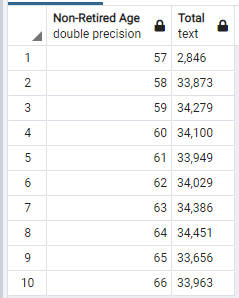

# Pewlett-Hackard Silver Tsunami Analysis Using SQL
The purpose of this analysis is to determine the number of retiring employees per title, and identify employees who are eligible to participate in a mentorship program.

## Summary of Tasks
### Deliverable 1
* Obtain a list of employees and their titles who are expected to retired based on their birtdate being between 01/01/1952 and 12/31/1955.
* Based on this list of retired employees, obtain a list and count of the job titles teh retirerees hold
* If we were to add birth dates to the original query, and obtain the age of each retireree, we would file the ages includes 67, 68, 69, and 70 years of age. The distribution is pretty even with amoungst all ages. Perhaps we can offer an additional bonus package to those aging at 67 and 68 years. They may want to delay their requirements or work part-time.

### Deliverable 2
* Obtain a list of retiring employees who are eligible to mentor others based on their birth date being 1965

## Resources
- Data Source: employees.csv, departments.csv, dept_emp.csv, titles.csv
- Software: pgAdmin4 v6.8, 
- Database: Postgres v11

## Summary of Results
* Below is a listing of the "retirements_title" table which was saved as a CVS file. There are 133,776 who are expected to retire.

* There are 7 types of job roles affected by this retirement. 
* Amazingly, there are very few Managers. Many Managers can be mentors to employees. This is a problem.

* There are only 1,549 eligible mentors.

## Summary
### Current Analaysis
* There are 133,776 out of 300,024 employees expected to retire. That's how many roles will need to be filled following the "Silver Tsunami". The type of job that is retiring the most are Senior Engineers and Senior Staff.

* There are far less who are able to provide mentorship. There are only 1,549 eligible mentors that can provide support with the majority being "Staff" or "Engineer". There is definitely not enough to mentor the next generation.

### Additional Analysis
Another area to research is how long some of these staff have remained in the row. Why wait until they are close to retirement age. The query for this is as follows:

    SELECT e.emp_no,
        e.first_name,
        e.last_name,
        ti.title,
        ti.from_date,
        ti.to_date,
        CASE 
            WHEN ti.to_date = '9999-01-01' THEN DATE_PART('year', now()::date) - DATE_PART('year', ti.from_date::date)
            ELSE DATE_PART('year', ti.to_date::date) - DATE_PART('year', ti.from_date::date)
        END as "YRS in Role"
    --INTO retirement_titles
    FROM employees as e
    INNER JOIN titles as ti
    ON e.emp_no = ti.emp_no
    WHERE e.birth_date > '1955-12-31'
    ORDER BY e.emp_no;

Another query is to find out what are the other age groups for non-retiring employees. Perhaps, some of these employees can be grouped into mid-level or senior-level mentoring partners. The query for this is as follows:

    SELECT e.emp_no,
        e.first_name,
        e.last_name,
        e.birth_date,
        DATE_PART('year', now()::date) - DATE_PART('year', e.birth_date::date) as emp_age,
        ti.title,
        ti.from_date,
        ti.to_date
    INTO non_retiring
    FROM employees as e
    INNER JOIN titles as ti
    ON e.emp_no = ti.emp_no
    WHERE (e.birth_date > '1955-12-31')
    ORDER BY e.emp_no;

    SELECT emp_age As "Non-Retired Age", TO_CHAR(COUNT(*), 'fm999G999') as "Total"
    FROM non_retiring as ra
    GROUP BY emp_age
    ORDER BY emp_age;

